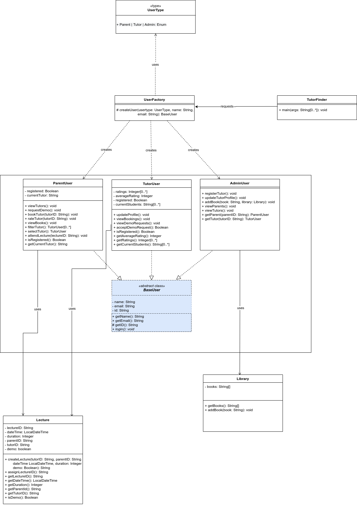

# SSD Assignment 1

**Group 12:** Online Private Tutors Finder System

**Team members:** Daniel Atonge, Magomed Magomedov, Ozioma Okonicha, Marko Pezer

**Chosen Pattern:** Factory method

## Description

This private tutor system will help to find tuition teachers from nearby locations. Teachers can also get a student just by logging onto the website and setting up the profile. In the personal tutor finder system, there are three entities namely, Admin, Parents, and Tutor. Admin can login, manage tutor by adding new teachers and update their profiles. Admin can also manage E-books by adding new books to the library. Admin can also check for the registered parents. Admin will register tutors and credentials will be shared with tutors by Email. Parents can register and login, tutors can be viewed by parents. Parents can filter and select the tutor and after selecting parents will raise the request of the demo lecture. After attending the lecture, they can book the tutor online, rate the tutor and view the E-Books. The tutor can login by using credentials that will be provided by mail. They can check for the request for a demo lecture and accept the request. They can also check the booking done. They need to set their profile. This private tuition system can help the tutors to get students and parents to find the best tutors for their children

## Introduction

**Factory method** is a creational design pattern that helps creating objects by eliminating the need to state the particular classes. Hence the user does not need to be aware of the inner implementations but simply create objects using the specified interface. This promotes the **loose-coupling** by eliminating the need to bind application-specific classes into the code and also adds flexibility to the code.

### Reason for the choice

The process for choosing started from us eliminating _Prototype_ from the given choices, because this design pattern creates exact replica and in our system. Each newly created entity is different and there is no case where an exact replica would be needed. Moreover, the process of creating new instances of users is not expensive, so we can indeed create blank objects each time a user is registered. Next, we thought about using _Abstract Factory_, but decided against it because in our system, the object types are only of a particular kind (i.e. the system has one family of objects which is _User_). So in this case _Abstract Factory_ would add an unnecessary level of abstraction into our system. So by elimination, our choice was _Factory Method_. The primary reasons why we chose this design pattern for our system are as follows:

- Having _Factory Method_ facilitates localization of the code for user creation by having a single entry point for this. In our case the creation is done only in the factory, as opposed to having multiple classes that can be called and created anywhere. This centralized approach makes the system more secure.
- The _Factory Method_ pattern allows us to create new _User_ objects without having to know the details of how they're created, or what their dependencies are. They only have to give the information they actually want i.e the type of User to be created.
- Finally, if we want to add new types of users in the long run, we can easily do so without distorting the architecture of the system.

## UML diagram

For our UML, first we created an enum _UserType_ to be able to easily switch case between the three different entity kinds during creation. Then we created a BaseUser abstract class as well as concrete classes (ParentUser, TutorUser, AdminUser) that extend the BaseUser abstract class. We decided to use an Abstract Class and not an Interface to defined the common user functonality because the abstract class allows us to store common data that every user has: id, email, name, etc. A factory class _UserFactory_ is then defined and the TutorFinder with the main driver will pass information (Parent|Tutor|Admin) to _UserFactory_ to get the concrete type of object it needs.

[draw.io](https://drive.google.com/file/d/1s-OACNZJmrj1O9ymWgSvHg7k4Jj9ybIP/view?usp=sharing)

Altogether,

1. We have **BaseUser** that is the abstract class and has methods common to the three classes that extend it: **ParentUser**, **TutorUser**, **AdminUser**.
2. **UserFactory** is the main factory that produces the user object with the _createUser_ method returning object of type **BaseUser**.
3. **ParentUser**, **TutorUser**, **AdminUser** which has the specifics of the three types of users.
4. The class that has the main driver is the **TutorFinder** class.

We have two other classes not related to the pattern, but mentioned in the description that we chose to include. The first is the Lecture class that contains information about a single lecture to be created. Second is Library which contains an array of book; where books are stored by their names as strings.

## Implementation

We implemented the structure illustrated by our UML diagram in java programming language, hosted on [github](https://github.com/Ozziekins/SSD).
