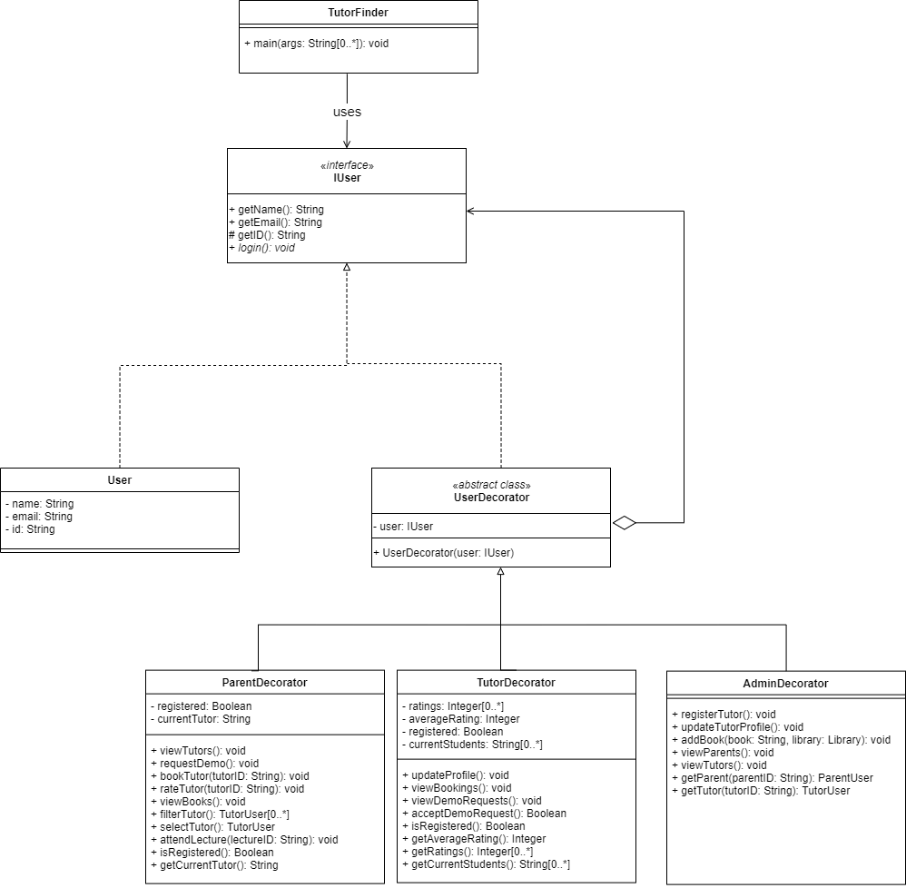

# SSD Assignment 2

**Group 12:** Online Private Tutors Finder System

**Team members:** Daniel Atonge, Magomed Magomedov, Ozioma Okonicha, Marko Pezer

**Chosen Pattern:** Decorator design pattern

## Description

This private tutor system will help to find tuition teachers from nearby locations. Teachers can also get a student just by logging onto the website and setting up the profile. In the personal tutor finder system, there are three entities namely, Admin, Parents, and Tutor. Admin can login, manage tutor by adding new teachers and update their profiles. Admin can also manage E-books by adding new books to the library. Admin can also check for the registered parents. Admin will register tutors and credentials will be shared with tutors by Email. Parents can register and login, tutors can be viewed by parents. Parents can filter and select the tutor and after selecting parents will raise the request of the demo lecture. After attending the lecture, they can book the tutor online, rate the tutor and view the E-Books. The tutor can login by using credentials that will be provided by mail. They can check for the request for a demo lecture and accept the request. They can also check the booking done. They need to set their profile. This private tuition system can help the tutors to get students and parents to find the best tutors for their children

## Introduction

**Decorator pattern** is a structural design pattern that helps in adding new functionality to an object dynamically; without altering the object's structure. The core object is wrapped recursively and each time provides additional functionality(or behaviour). This is used instead of inheritance as it promotes **flexibility** by eliminating the rigid nature of inheritance and allowing the client to add any feature to an object.

### Reason for the choice

...

## UML diagram

For our UML, first we created an __IUser__ interface and concrete class __User__ implementing the __IUser__ interfae. Then we created an abstract decorator class __UserDecorator__ implementing the __IUser__ interface and having __IUser__ object as its instance variable. __ParentDecorator__, __TutorDecorator__ and __AdminDecorator__ implement __UserDecorator__. Finally our demo class __TutorFinder__ which has the main driver uses __UserDecorator__ to decorate __IUser__

[draw.io](https://drive.google.com/file/d/1bQxJDNtBNOLCxc6o5UPLgUivhAcd1mDs/view?usp=sharing)

Altogether,

1. The interface __IUser__ that has the commo interface for the objects being wrapped and the wrappers
2. **User** is the concerete class that implements the interface **IUser** and is the class that is wrapped by the decorators.
3. We have **UserDecorator** that is the abstract class with the field type of the wrapped object (__user__) same as __IUser__ so that it can create users and decorators.
4. Concrete decorator classes: **ParentDecorator**, **TutorDecorator** and **AdminDecorator** which can be used to decorate a user.
5. The class that has the main driver is the **TutorFinder** class and can wrap users in multiple layers of decorators.

## Implementation

We implemented the structure illustrated by our UML diagram in java programming language, hosted on [github](https://github.com/Ozziekins/SSD/tree/main/assignment-2).  We have two other classes not related to the pattern, but mentioned in the description that we chose to include. The first is the Lecture class that contains information about a single lecture to be created. Second is Library which contains an array of book; where books are stored by their names as strings.