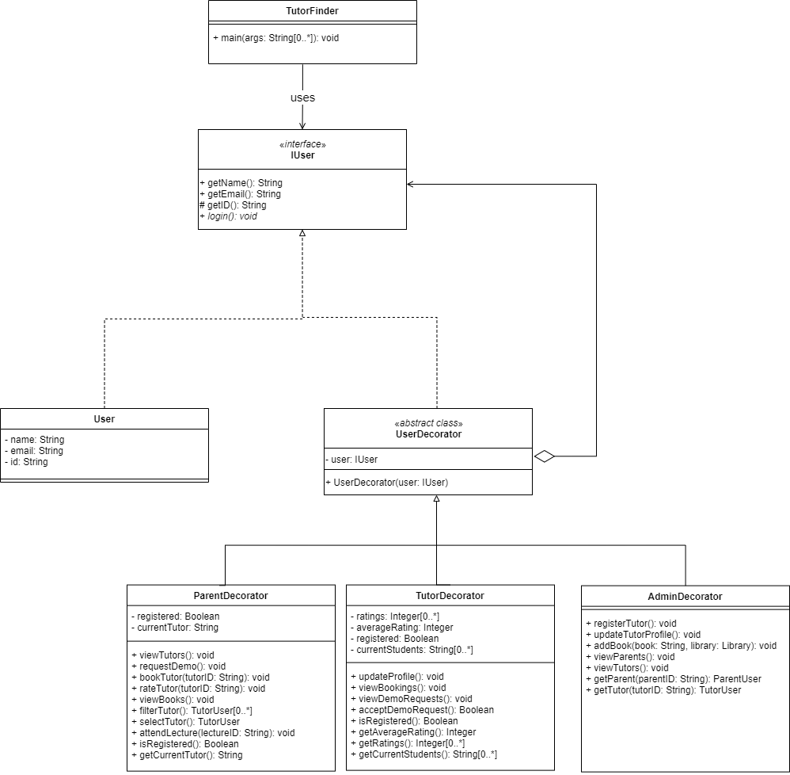

# SSD Assignment 2

**Group 12:** Online Private Tutors Finder System

**Team members:** Daniel Atonge, Magomed Magomedov, Ozioma Okonicha, Marko Pezer

**Chosen Pattern:** Decorator design pattern

## Description

This private tutor system will help to find tuition teachers from nearby locations. Teachers can also get a student just by logging onto the website and setting up the profile. In the personal tutor finder system, there are three entities namely, Admin, Parents, and Tutor. Admin can login, manage tutor by adding new teachers and update their profiles. Admin can also manage E-books by adding new books to the library. Admin can also check for the registered parents. Admin will register tutors and credentials will be shared with tutors by Email. Parents can register and login, tutors can be viewed by parents. Parents can filter and select the tutor and after selecting parents will raise the request of the demo lecture. After attending the lecture, they can book the tutor online, rate the tutor and view the E-Books. The tutor can login by using credentials that will be provided by mail. They can check for the request for a demo lecture and accept the request. They can also check the booking done. They need to set their profile. This private tuition system can help the tutors to get students and parents to find the best tutors for their children

## Introduction

**Decorator pattern** is a structural design pattern that helps in adding new functionality to an object dynamically; without altering the object's structure. The core object is wrapped recursively and each time provides additional functionality(or behaviour). This is used instead of inheritance as it promotes **flexibility** by eliminating the rigid nature of inheritance and allowing the client to add any feature to an object.

### Reason for the choice

The process of selecting a final pattern started with examination of each of the 4 available patterns. _Bridge_ pattern quickly fell off, because we knew we didn't have 2 separate inheritance trees that we would need to link together. _Flyweight_ also felt out of place, since there was nothing on the user part that could have been moved into some common store, i.e. every user's name and email was unique and belonging only to them. The _Composite_
pattern was of no use as well as we don't have a situation where we would want to treat a user and a group of users uniformly, as a whole entity.

After carefully considering all other patters, we came up with three primary reasons for choosing the decorator pattern:

- First, in our _Tutor finding system_, if we have a situation where a user who is an admin is also a parent, we want to be able to transparently and dynamically add the parent responsibilities to an admin user entity without affecting other user objects.
- Secondly, following the same logic mentioned above, the same way we want to be able to add other responsibilities to the user object, we may also want to change it in the future. The decorator pattern allows for a flexible changing mechanism.
- Finally, the decorator pattern allowed us to avoid using the impractical method of sub-classing; such that we don't need to create many other classes like: _AdminParent_, _AdminTeacher_, _ParentTeacher_, etc. Instead of such static implementation, decorator allows us to extend the functionalities in a dynamic and easier way.

## UML diagram

For our UML, first we created an **IUser** interface and concrete class **User** implementing the **IUser** interface. Then we created an abstract decorator class **UserDecorator** implementing the **IUser** interface, while simultaneously having an **IUser** object it will be decorating as its constructor parameter. **ParentDecorator**, **TutorDecorator** and **AdminDecorator** implement **UserDecorator**. Finally our demo class **TutorFinder** which has the main driver uses multiple **UserDecorator**s to decorate **IUser**

[draw.io](https://drive.google.com/file/d/1bQxJDNtBNOLCxc6o5UPLgUivhAcd1mDs/view?usp=sharing)

Altogether,

1. The interface **IUser** is common for the core user being decorated and the decorators.
2. **User** is the concerete class that implements the interface **IUser**.
3. **UserDecorator** is the abstract class with contructor accepting an **IUser** object being wrapped and exposesing the object's public methods to conform to the nterface.
4. Concrete decorator classes: **ParentDecorator**, **TutorDecorator** and **AdminDecorator** which can be used to decorate a user.
5. The class that has the main driver is the **TutorFinder** class and can wrap users in multiple layers of decorators.

## Implementation

We implemented the structure illustrated by our UML diagram in java programming language, hosted on [github](https://github.com/Ozziekins/SSD/tree/main/assignment-2). We have two other classes not related to the pattern, but mentioned in the description that we chose to include. The first is the Lecture class that contains information about a single lecture to be created. Second is Library which contains an array of book; where books are stored by their names as strings.
