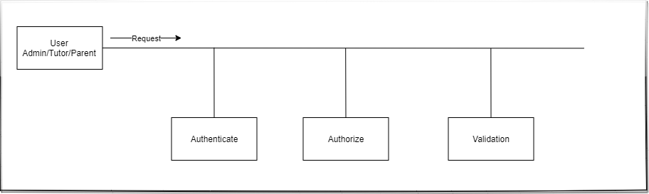
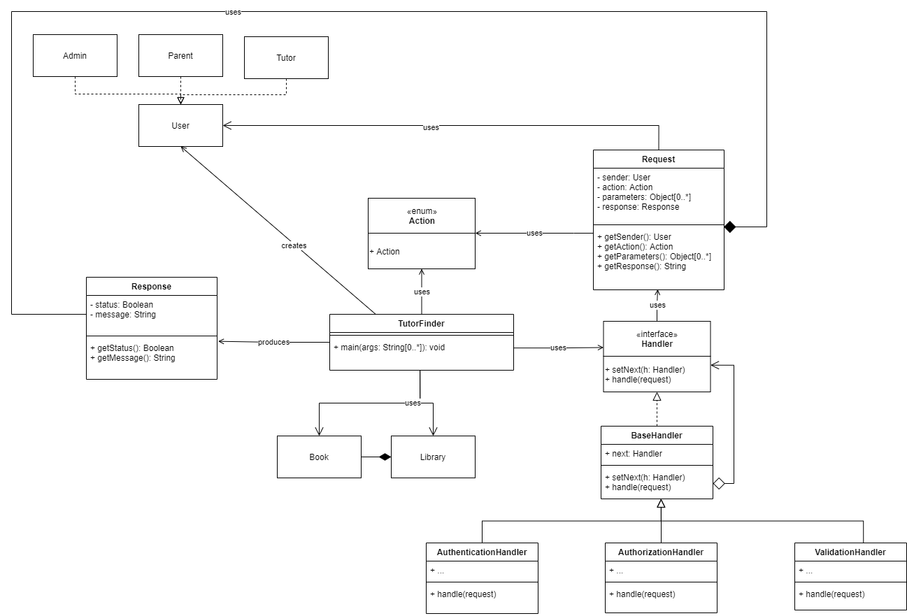

# SSD Assignment 3

**Group 12:** Online Private Tutors Finder System

**Team members:** Daniel Atonge, Magomed Magomedov, Ozioma Okonicha, Marko Pezer

**Chosen Pattern:** Chain of responsibility design pattern

## Description

This private tutor system will help to find tuition teachers from nearby locations. Teachers can also get a student just by logging onto the website and setting up the profile. In the personal tutor finder system, there are three entities namely, Admin, Parents, and Tutor. Admin can login, manage tutor by adding new teachers and update their profiles. Admin can also manage E-books by adding new books to the library. Admin can also check for the registered parents. Admin will register tutors and credentials will be shared with tutors by Email. Parents can register and login, tutors can be viewed by parents. Parents can filter and select the tutor and after selecting parents will raise the request of the demo lecture. After attending the lecture, they can book the tutor online, rate the tutor and view the E-Books. The tutor can login by using credentials that will be provided by mail. They can check for the request for a demo lecture and accept the request. They can also check the booking done. They need to set their profile. This private tuition system can help the tutors to get students and parents to find the best tutors for their children

## Introduction

**Chain of responsibility pattern** is a behavioural design pattern that helps to achieve **loose coupling** in software design where a request from the client is passed to a chain of objects to process them. Later, the object in the chain will decide themselves who will be processing the request and whether the request is required to be sent to the next object in the chain or not.

### Reason for the choice

The process of selecting a final pattern began with a deep understanding of the project requirements. Our project emphasized on how different users could access, manage and interact with resources. While certain users are allowed to carry out certain operations, other users should not be able to do so. The pattern we are to use should be able to pass request through some sort of handlers, these handlers are to be executed on the request to make sure that the passed request is valid for the given user. This use case is perfect to be implemented using the Chain of responsibility behavioural design pattern.

In our system in particular, what we aimed to achieve is to take each incoming request from a user, first verify that this user is loggen in. Then check the user role and that they have the right permission to carry out request and finally ensure that the object at the receiving end of the request exists. Intuitively, it looks like this:

## UML diagram

For our UML, first we created an interface _Handler_ that is common for all concrete handlers. It possesses the main method _handle_ that handles a user request, as well as a method to set the next handler. Next is the class _BaseHandler_ that implements the interface and it is responsible for setting the next handler. Then we have three concrete handlers: _AuthenticationHandler_, _AuthorizationHandler_ and _ValidationHandler_. They inherit from the class _BaseHandler_ and each have their own responsibility of checking if the user is logged in, the user permission and the existence (validity) of the request receiver respectively.

[draw.io](https://drive.google.com/file/d/1M4ot91Q7X28JM0xkW9K-pERs3s9-h3Nr/view?usp=sharing)

Altogether,

1. The interface _Handler_ is common for the concrete handlers.
2. _BaseHandler_ is the concerete class that implements the interface _Handler_.
3. Concrete handler classes: _AuthenticationHandler_, _AuthorizationHandler_ and _ValidationHandler_ which carry out their appropriate checks.
4. The class that has the main driver is the _TutorFinder_ class and creates the users which can perform requests that will go through all checks in our chain of responsibility.  
5. The _Action_ enum holds all actions (operations) possible in our system
6. The _Request_ class simulate possible actions made by certain users in our system and also holds the parameters needed to execute the stated action
7. Finally, the _Response_ call keeps track of the status of the request object and a corresponding message.

> Due to the fact that the focus of this assignment is behaviour and not creation or structure, we did not focus on the pattern used to create the users. This was covered in earlier assignments, and that is the reason for illustrating the users as simple boxes.

## Implementation

We implemented the structure illustrated by our UML diagram in java programming language, hosted on [github](https://github.com/Ozziekins/SSD/tree/main/assignment-3).
